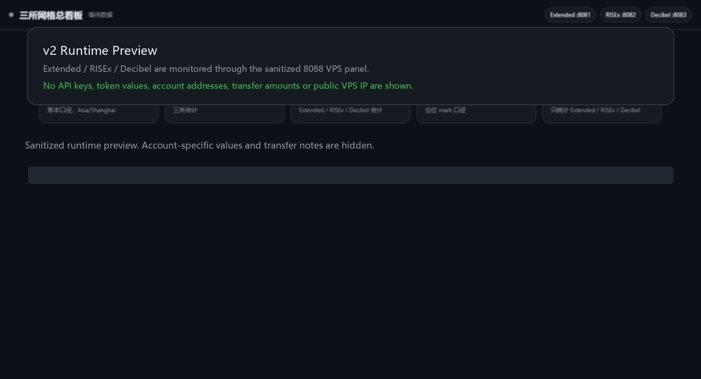
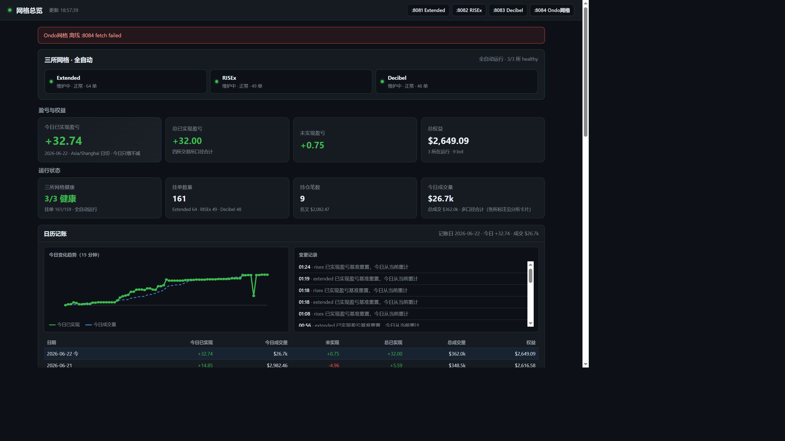
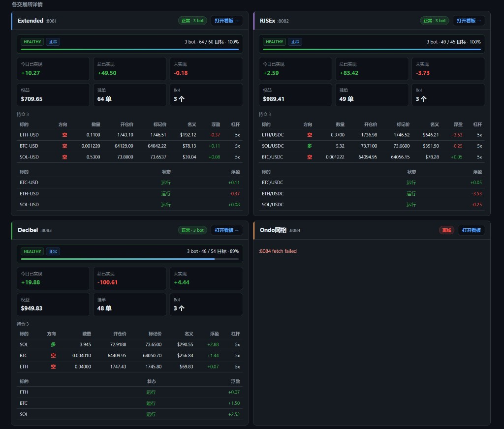
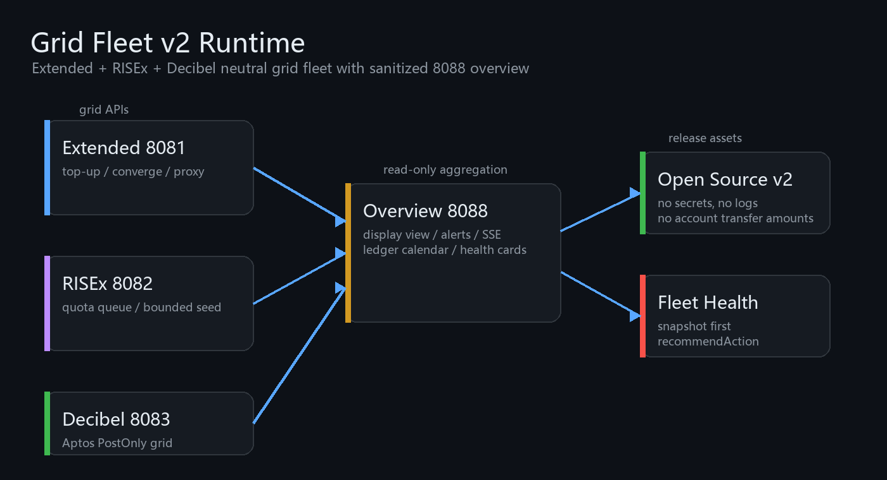

# Multi-Venue Neutral Grid Fleet

三所永续中性网格 + 总看板的**开箱即用**参考实现。策略参数、舰队维护、库存控制、看板聚合均与作者生产环境对齐；填好 API 凭证即可运行。

[](LICENSE)

| 应用 | 交易所 | 栈 |
|------|--------|-----|
| `apps/extended-grid` | [Extended](https://app.extended.exchange/join/AIQIANG888) | Node ESM，零依赖 HTTP + SSE 看板 |
| `apps/risex-grid` | [RISEx](https://developer.rise.trade/) | Node ESM + 链上适配 |
| `apps/decibel-grid` | [Decibel](https://app.decibel.trade/r/K7B2QM) | TypeScript + Aptos / Decibel SDK |
| `apps/overview` | 聚合上列三所 | TypeScript 只读总看板 |

**环境要求**： [Node.js](https://nodejs.org/) **≥ 20**（Decibel / Overview 使用 `tsx`）

> **免责声明**：本仓库为策略与控制面参考代码，不构成投资建议。实盘需自行承担风险，妥善保管 API 密钥与私钥。详见 [SECURITY.md](SECURITY.md)。

## 界面预览（实盘截图）

| Extended 网格看板 | 三所总看板 |
|:--:|:--:|
|  |  |

**各交易所详情（总看板底部）**



*来自作者 VPS 实盘运行界面（SSH 隧道本地截取，地址栏为 `127.0.0.1`，无公网 IP）。*

## 文档

| 文档 | 内容 |
|------|------|
| **[docs/OPEN_SOURCE.md](docs/OPEN_SOURCE.md)** | **开源总览（表格）**：是什么/不是什么、参数对照、能力清单 |
| **[docs/SETUP.md](docs/SETUP.md)** | **API 密钥怎么填**（含 Decibel 逐步说明）、启动顺序 |
| [docs/STRATEGY.md](docs/STRATEGY.md) | 中性网格策略参数与维护逻辑 |
| [docs/PITFALLS.md](docs/PITFALLS.md) | 实盘踩坑与运维禁忌 |
| [docs/API.md](docs/API.md) | HTTP API（snapshot / fleet 控制） |
| [CHANGELOG.md](CHANGELOG.md) | 版本记录 |
| [CONTRIBUTING.md](CONTRIBUTING.md) | 贡献指南 |
| [SECURITY.md](SECURITY.md) | 安全与密钥规范 |

## 策略概要

- **模式**：中性网格（neutral），每所 **3 槽** BTC / ETH / SOL
- **区间**：现价 ±**2.4%**（`rangeHalfPct=0.024`）
- **格数**：Extended 24 / RISEx 18 / Decibel 22
- **杠杆**：5x
- **破区间**：移框重挂（`autoRecenter` / `shiftGrid`），默认不平仓
- **库存**：净仓超 `4×sizeBase` 停同向加仓；reduce-only 覆盖约 **70%** 持仓
- **偏少**：`replenishIfEmpty` 补格，**不**因偏少整盘 recenter

## 快速开始

### Mac / Linux（推荐）

```bash
git clone https://github.com/beibei030/grid-fleet.git
cd grid-fleet
chmod +x scripts/*.sh
./scripts/install-all.sh

cp apps/extended-grid/.env.example apps/extended-grid/.env
cp apps/risex-grid/.env.example apps/risex-grid/.env
cp apps/decibel-grid/.env.example apps/decibel-grid/.env
cp apps/overview/.env.example apps/overview/.env
# 编辑四个 .env，填入凭证与各 PORT / URL

./scripts/start-all.sh   # 或分别 scripts/start-extended.sh 等
```

### 手动逐进程

```bash
# 1. Extended
cd apps/extended-grid && cp .env.example .env && node server.js

# 2. RISEx
cd apps/risex-grid && cp .env.example .env && node server.js

# 3. Decibel
cd apps/decibel-grid && npm i && cp .env.example .env && npm run start

# 4. 总看板（三所都起来之后）
cd apps/overview && npm i && cp .env.example .env && npm run start
```

各所 `PORT` 自行在 `.env` 指定；总看板的 `*_GRID_FLEET_URL` 填对应本机地址。**详细凭证获取与 Decibel 配置见 [SETUP.md](docs/SETUP.md)。**

## 架构

```
Overview（总看板）──HTTP──► Extended grid
                    ├──► RISEx grid
                    └──► Decibel grid

各所独立进程；共享策略思想，交易所适配器分别实现。
```



## 相关 API 文档

- Extended: https://api.docs.extended.exchange/
- RISEx: https://developer.rise.trade/reference/integration
- Decibel: https://docs.decibel.trade/typescript-sdk/write-sdk

## License

[MIT License](LICENSE) — Copyright (c) 2026 beibei030

## 贡献

Issue / PR 欢迎。请勿在 PR 中包含 `.env`、私钥或真实账户地址。见 [CONTRIBUTING.md](CONTRIBUTING.md)。
